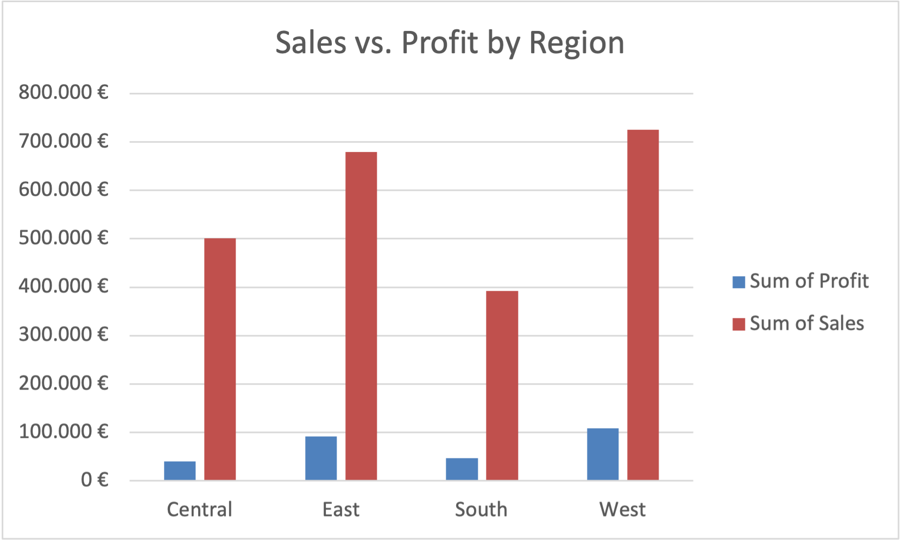

# Superstore Sales Analysis

Analysis of a retail sales dataset (Superstore) using Excel pivot tables.

## Question
Which region generates the most **sales** — and which generates the most **profit**? Are they the same?

## Approach
- Built a pivot table grouping orders by region
- Summed sales and profit per region
- Visualized the comparison in a column chart

## Result

| Region  | Sales      | Profit    |
|---------|-----------|-----------|
| West    | 725,458 € | 108,418 € |
| East    | 678,781 € | 91,523 €  |
| Central | 501,240 € | 39,706 €  |
| South   | 391,722 € | 46,749 €  |

## Key Insight
**Sales and profit don't move together.** West and East lead in both — they rank 1st and 2nd in sales *and* profit. The interesting part is at the bottom: **Central ranks 3rd in sales but drops to last (4th) in profit**, while **South ranks last in sales yet earns more profit than Central**. 

Central's profit margin is only ~8%, compared to ~15% for West. High revenue does not guarantee high profit.

A likely driver worth investigating further: discounts. Central may be buying its sales volume with margin-eroding discounts.

## Tools
Excel (pivot tables, charts)
